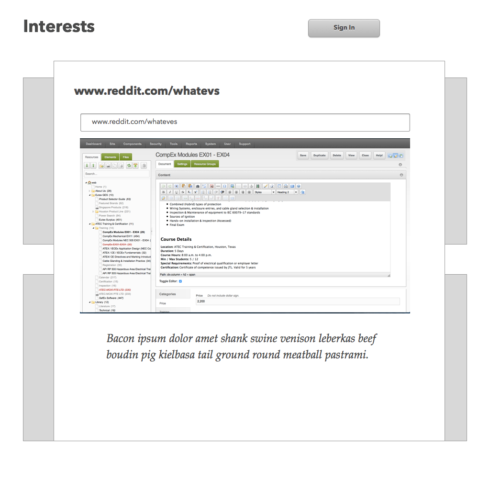
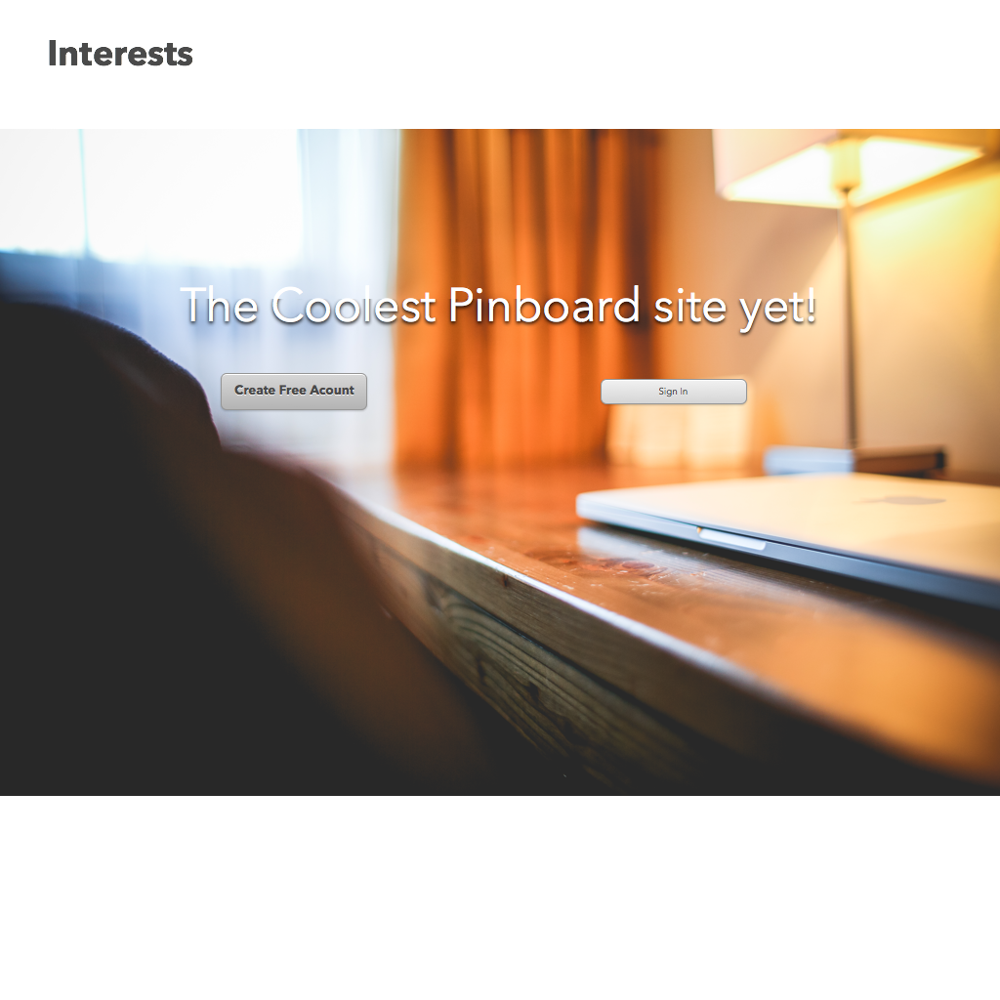
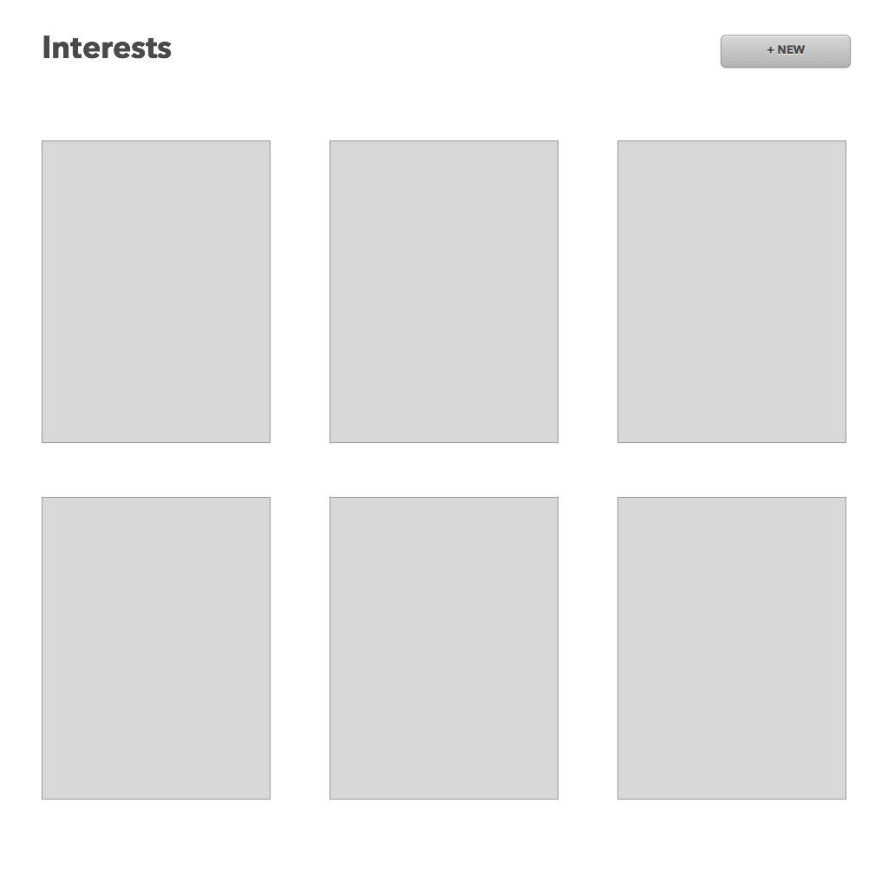
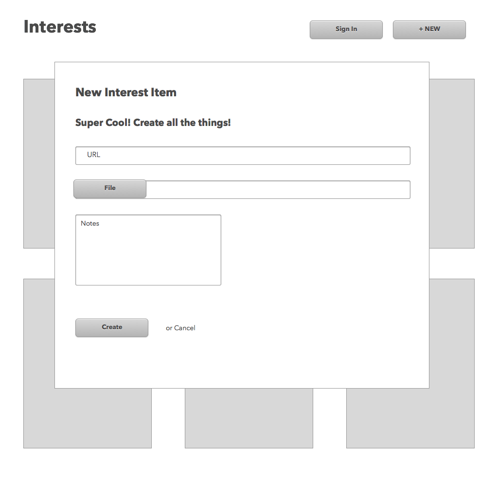

# Pinterest Week 7 Lab

## Description
Pinterest Week 7 Lab - Use JavaScript in Rails for Maximum Awesome

## Objectives

### Learning Objectives

After completing this assignment, you should…

* JavaScript proficiently
* Understand the Rails Remote Form cycle
* Create a single page application

### Performance Objectives

After completing this assignment, you be able to effectively use

* Rails remote forms
* jQuery
* BootStrap Modals

## Details

### Deliverables

* A repo containing at least:
  * a Seeded Database
  * a working and validiable User model, with a secure password
  * bootstrap-sass (both scss and js)

### Requirements

* Create a Pinterest System. Let's call it "Interests"
* Secure using an DIY authentication system
* Allow people to upload a screenshot and specify a URL. Allow optionally notes
* There should be no page loads during the entire project, only remote links and
  remote forms
* Live on Heroku
* Use `https://github.com/JangoSteve/remotipart` to add ability to upload files
  on remote JS forms

Mockups:
--------

## Easy Mode

* Have the main homepage, and sign-in / sign-up can be their own pages
            
## Hard Mode

* Add an autocomplete dropdown text box that lets you search your notes and urls
* Have the main homepage, and sign-in / sign-up should not be their own pages,
  but should be re-rendered when the user signs in
* Sign in should also be a modal
            
## Nightmare Mode

* Pull JSON for the stored pins from /pins.json and render using Handlebars
* Have tests for your models

## Notes

* This can be difficult, breathe. 

## Additional Resources

* Visit [pinterest](https://www.pinterest.com/)
* Read [Remote Rails](http://www.alfajango.com/blog/rails-3-remote-links-and-forms/)
* [Other Sample Site](https://myinterests.herokuapp.com/)
* [3rd Sample Site](https://calm-garden-8016.herokuapp.com/)
